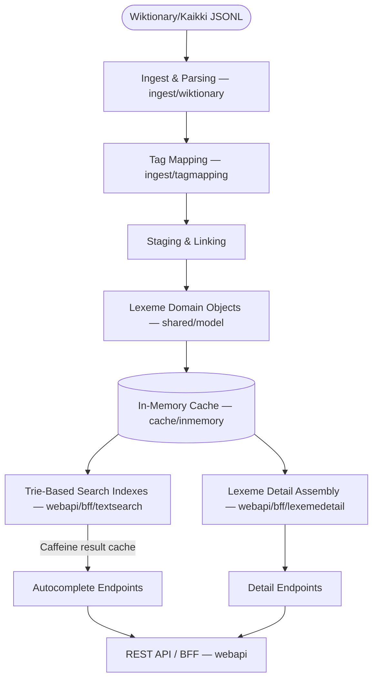
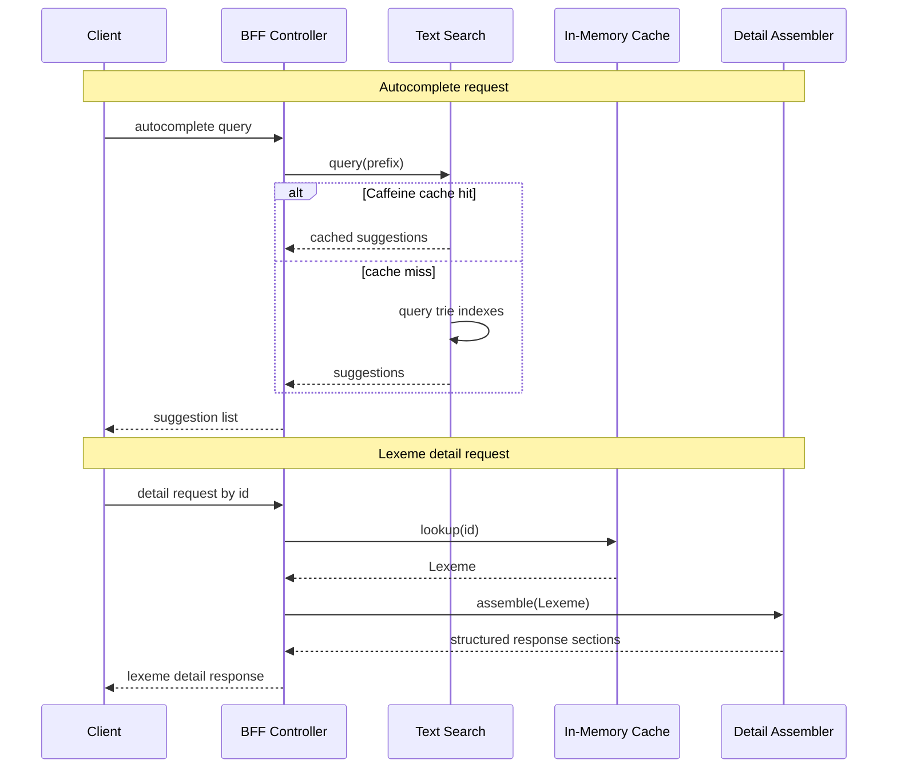

# LexiconMeum Architecture

This document summarizes the backend structure for contributors and coding agents.

## Overview

LexiconMeum is a Spring Boot service that provides Latin lexical lookup APIs. The backend ingests machine-readable Wiktionary/Kaikki lexical data, maps it into domain objects, stores lexemes in an in-memory cache, builds text-search indexes, and serves frontend-oriented REST responses.

At a high level:

At request time, the two main paths through the system are:

## Main responsibilities

The backend is organized around five main responsibilities:

1. ingest raw lexical data
2. normalize source tags and grammatical metadata
3. link related lexical information after parse
4. provide fast search and detail lookup paths
5. assemble API responses for frontend use

## Ingestion and parsing

The ingestion layer reads JSONL lexical records and delegates parsing by part of speech.

Relevant packages:

- `src/main/java/com/annepolis/lexiconmeum/ingest/wiktionary`
- `src/main/java/com/annepolis/lexiconmeum/ingest/tagmapping`

This layer is responsible for:

- interpreting head templates and lexical metadata
- mapping raw source tags into typed grammatical concepts
- creating `Lexeme` objects and part-of-speech-specific detail objects
- collecting inflection and agreement data
- handling source inconsistencies without pushing that complexity into the API layer

The source data is rich, but it is not already shaped for direct application use. The ingestion layer converts source records into normalized application models.

## Staging and linking

Some lexical relationships are not fully represented in a single source record. The backend uses a staging/linking step to resolve those relationships after parsing.

This stage is used to:

- accumulate parsed lexical fragments
- connect related forms once enough information is available
- keep downstream search and API assembly code simpler

This separation keeps source-specific edge cases out of controllers and DTO mappers.

## Domain model

The shared model captures lexical structure and grammar in typed form.

Relevant package:

- `src/main/java/com/annepolis/lexiconmeum/shared/model`

### Core concepts include:

- **Lexeme**: The fundamental dictionary entry (e.g., _amō_). Each contains a unique ID derived from its lemma, part of speech, and etymology.
- **Sense**: The definitions, glosses, and English translations tied to a `Lexeme`.
- **Inflections**: The written inflected forms of a lexeme (e.g., _"amat"_).
- **Inflection Key**: A serialized string identifying a specific grammatical slot.
    - _Example Key:_ `ACTIVE|INDICATIVE|PRESENT|THIRD|SINGULAR`
- **Grammar Enums**: Strongly typed Java enums enforcing valid linguistic categories (`Case`, `Number`, `Gender`, `Person`, `Tense`, `Mood`, `Voice`, `Degree`).
- **Part-of-Speech Details**: Specific metadata models for distinct word classes (e.g., noun declensions, verb conjugations).

### Design rationale

The domain model uses typed grammar concepts instead of passing raw source strings through the application. That keeps parser concerns, search logic, and API response assembly better separated.

## Search and indexing

Autocomplete is handled through a dedicated text-search layer rather than direct scanning of loaded lexical data.

Relevant package:

- `src/main/java/com/annepolis/lexiconmeum/webapi/bff/textsearch`

This layer is responsible for:

- deriving searchable forms from lexemes
- indexing principal and other useful lookup forms in trie-based indexes
- supporting prefix and suffix autocomplete queries
- using Caffeine caching for repeated query/result paths
- mapping matched results into suggestion responses

### Search tradeoffs

The current design favors fast in-memory reads over an external search service. That keeps the runtime model simple and easy to operate, while accepting limits tied to dataset size, in-process memory, and the current index design.

## API and response assembly

The REST layer acts as a backend-for-frontend. It exposes responses shaped for client use rather than mirroring raw ingest output.

Relevant packages:

- `src/main/java/com/annepolis/lexiconmeum/webapi`
- `src/main/java/com/annepolis/lexiconmeum/webapi/bff/lexemedetail`

Main responsibilities:

- serve autocomplete endpoints
- retrieve lexeme detail by id
- assemble structured response sections for lexical and grammatical data
- keep response generation modular through dedicated assemblers and contributors

This separation allows the API contract to evolve independently from the parser internals.

## Runtime storage

The application currently stores loaded lexical data in an in-memory cache.

Relevant package:

- `src/main/java/com/annepolis/lexiconmeum/cache/inmemory`

### Runtime tradeoffs

This design provides:

- simple deployment
- fast local reads
- no database dependency for the current project scope

It also means:

- startup work is tied to data loading
- scale is limited by process memory
- persistence and refresh behavior are more constrained than in a database-backed design

## Module map

Quick lookup by responsibility:

- **Ingest/parsing:** `src/main/java/com/annepolis/lexiconmeum/ingest/wiktionary`
- **Tag mapping:** `src/main/java/com/annepolis/lexiconmeum/ingest/tagmapping`
- **Shared domain model:** `src/main/java/com/annepolis/lexiconmeum/shared/model`
- **In-memory cache:** `src/main/java/com/annepolis/lexiconmeum/cache/inmemory`
- **Autocomplete/search:** `src/main/java/com/annepolis/lexiconmeum/webapi/bff/textsearch`
- **Lexeme detail assembly:** `src/main/java/com/annepolis/lexiconmeum/webapi/bff/lexemedetail`
- **Web/API configuration:** `src/main/java/com/annepolis/lexiconmeum/webapi`

## Configuration

Runtime configuration lives in `src/main/resources`:

- `application.yml`
- `application-local.yml`
- `application-dev.yml`
- `log4j2.properties`
- `log4j2-dev.properties`

Tests use:

- `src/test/resources/application-test.yml`

## Testing

Tests are organized close to the behavior they cover:

- parser tests
- tag-mapping and grammar tests
- domain-model tests
- text-search tests
- lexeme-detail and inflection-assembly tests

This keeps parsing rules, grammar modeling, search behavior, and response shaping independently testable.

## Diagrams

The overview flowchart in this document is the primary architecture diagram. It is maintained inline as a Mermaid block and renders on GitHub.

## Design constraints

- keep ingest concerns separate from API response assembly
- keep grammar concepts typed rather than string-based
- avoid coupling frontend response shapes to source-data quirks
- favor small, local parser and mapper changes over broad abstractions
- keep API changes intentional because the frontend depends on response shape